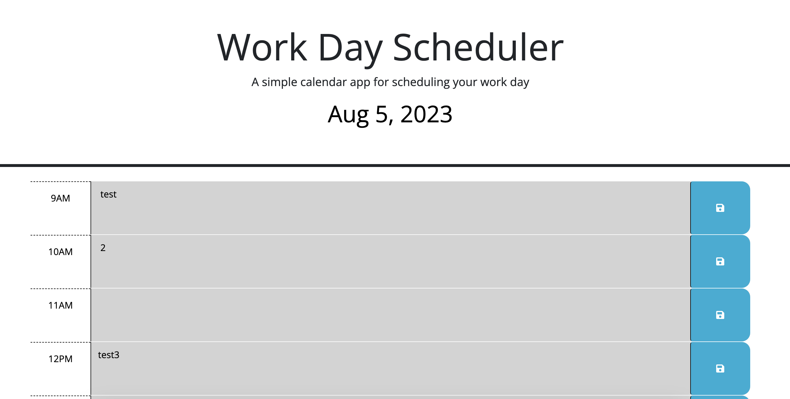

# Work Day Scheduler

## Description
Developed a simple calendar application that allows a user to save events for each hour of a typical working day (9am–5pm) by modifying starter code. This app will run in the browser and feature dynamically updated HTML and CSS powered by jQuery.

## Usage

Deployed link: https://dianafabela8.github.io/work-day-scheduler/
